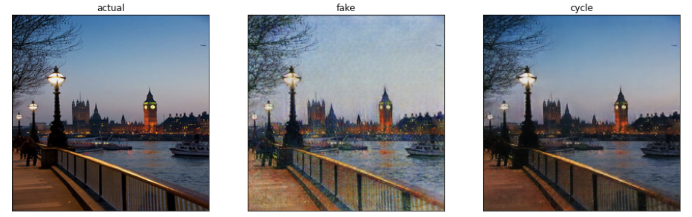

#  CycleGAN-for-Monet-style-inference

This project aims to build and train a CycleGAN architecture to infer Monet's style on normal photographs of landscapes.

The idea is based on the paper "Unpaired Image-to-Image Translation using Cycle-Consistent Adversarial Networks" by Zhu, Park et al.
For a detailed explanation of how this works, I invite you to take a look at their project's page: [Unpaired Image-to-Image Translation using Cycle-Consistent Adversarial Networks](https://junyanz.github.io/CycleGAN/).

There is also a Kaggle competition based on this task: [I'm Something of a Painter Myself](https://www.kaggle.com/competitions/gan-getting-started/overview). My best submission scored 37.92 points, but it doesn't get shown in the leaderboard anymore for some reason. ([Submission link](https://www.kaggle.com/code/andreiarnautu/i-m-something-of-a-painter-myself/notebook)]

##  Brief idea description

Essentially, we have images from 2 categories:
*  Monet images - these are paintings by Monet
*  Photo images - these are photographs of real landscapes around the world

Our model's task is to perform the following transformations:
*  Monet -> Photo - take a Monet image and turn it into a photo of a landscape
*  Photo -> Monet - take a Photo image and turn it into a Monet painting

As you can imagine, for neither of these cases there is no perfect transformation. There could be multiple ways to transform an image into a compelling counterpart. The most important thing is to retain the objects and structure in the initial image and infer the style of the target image class to it.

For each of the transformations above we will have 2 neural nets, as follows:
*  generator (G) - this network takes as input the original image (i.e. Photo / Monet) and produces its counterpart as an output (i.e. Monet / Photo).
*  discriminator (D) - the aim of this network is to discriminate between the original images in our dataset (e.g. real Monet paintings) and the fake images generated by G (fake Monets).

The model will be trained against itself: the aim of G is to generate more and more realistic images and the aim of D is to better discriminate between the images generated by G and the real images in our dataset. In other words, the aim of G is to fool D, and the aim of D is to not get fooled by G.

## Results

Here are some of the results that I obtained.
From left to right we have:
*  the original image
*  the transformed(fake) image 
*  the reconstructed(cycled) image

